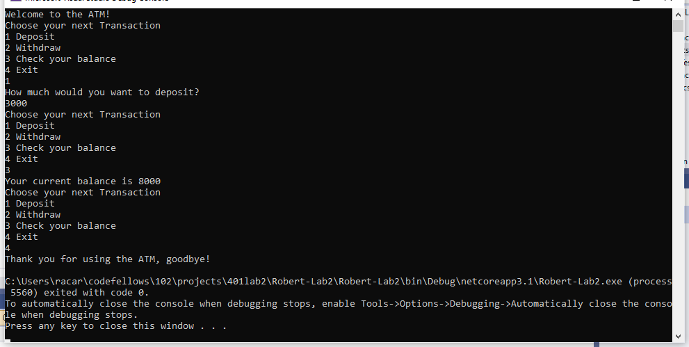

# ATM Application README
##### Lab02-Unit-Testing
##### Author: Robert Carter
##### Collaboration with: Nicholas Ryan

### Description

##### This is a C# console application that will allow the user to act as if they were using an ATM. Questions include asking for deposits, withraws, balance inquiries, and the ability to exit the application.

#### Getting started

##### Clone this repository to your local machine.
###### $ git clone https://github.com/racarter1215/Lab-02-UNIT-TESTING.git

### To run this application from VS:

##### Select File, then Open, then Project/Solution
##### Find the location of the cloned Repository
##### Select Robert-Lab2 folder
##### Select the next Robert-Lab2 folder
##### Select the Program.cs document

### Application Start

### Application Use Part 1
###### Follow prompts to navigate application

### Application Use Part 2
###### When one feature is used, it takes you back to main menu

### Application End
###### Press "4" then Enter to exit application

#### Change Log
###### 1.3: TAs troubleshot technical problems with app execution - 7 July 2020
###### 1.2: README completed - 7 July 2020
###### 1.1: App first created - 7 July 2020

